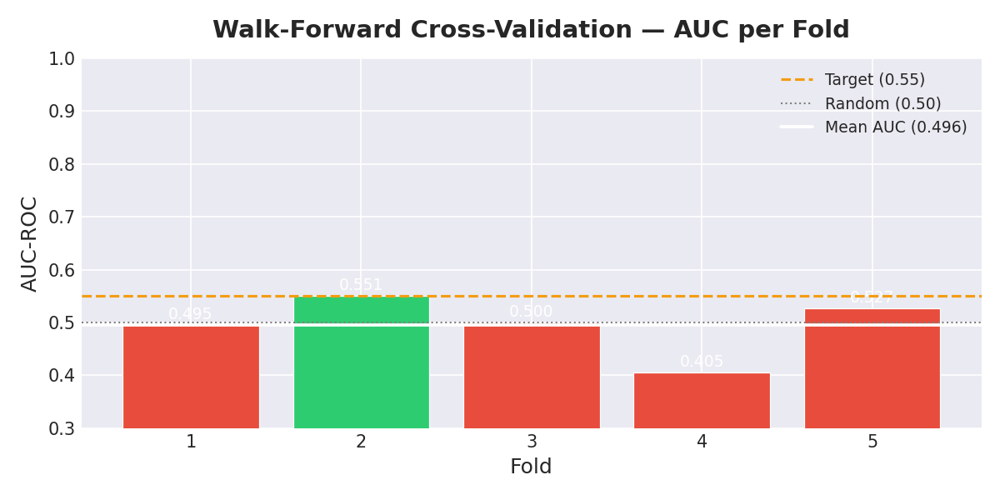
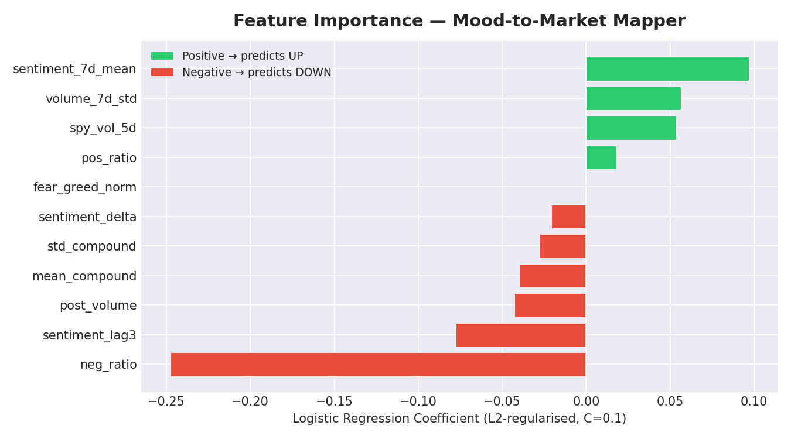
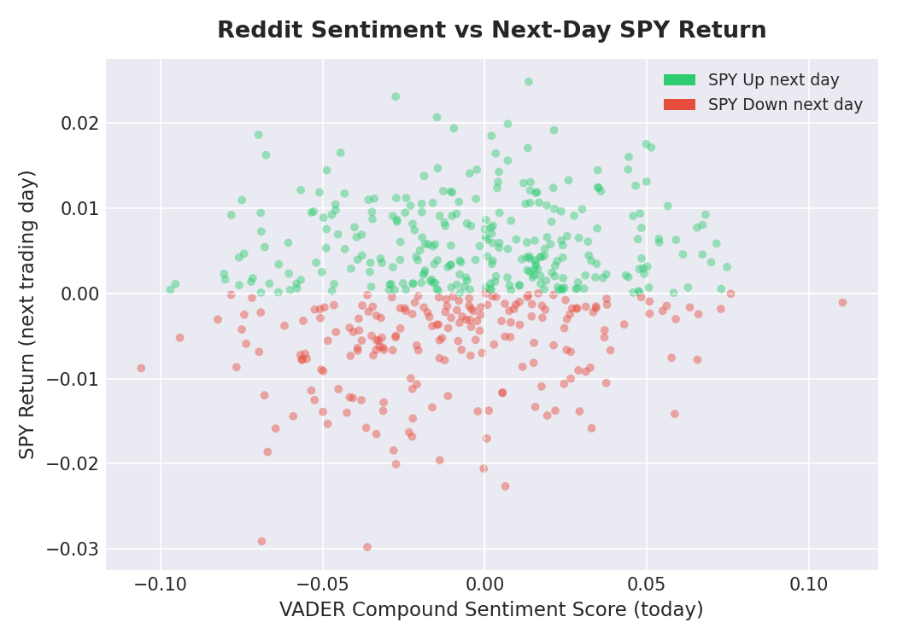
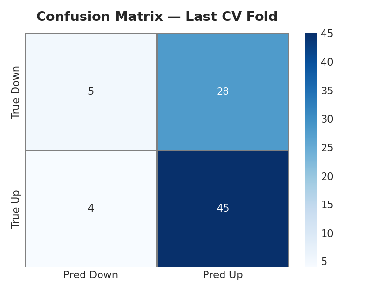
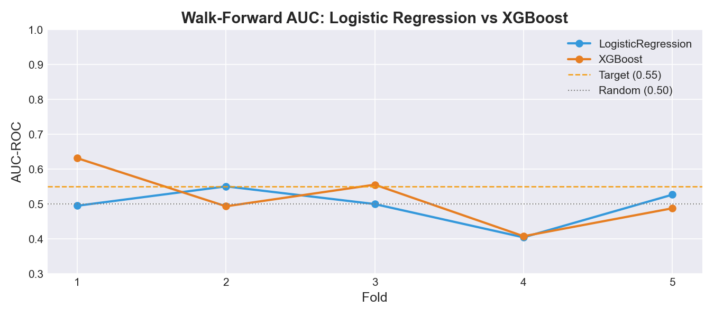
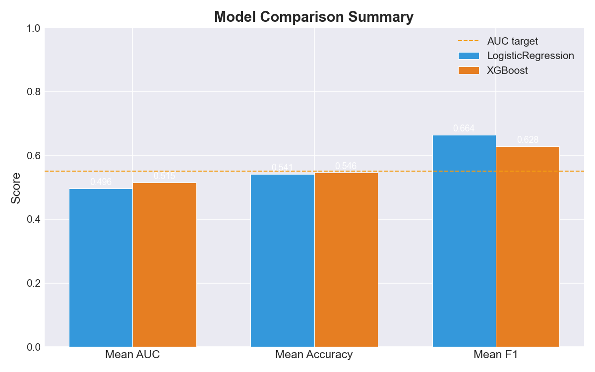
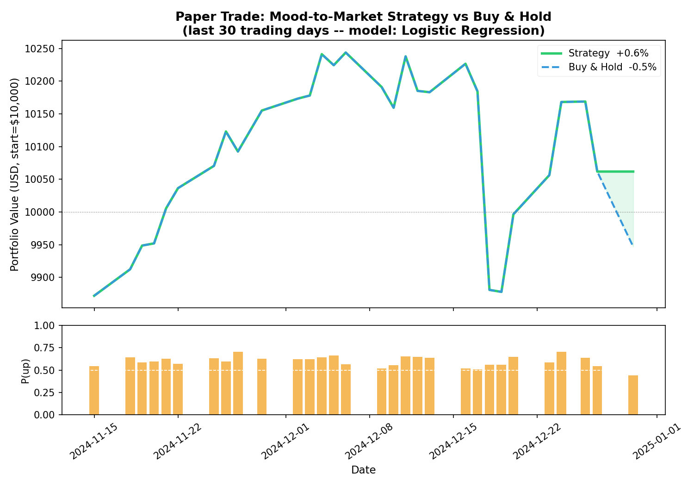

<p align="center">
  
</p>

<h1 align="center">📈 Mood-to-Market Mapper</h1>

<p align="center">
  <strong>Turning Reddit sentiment into SPY market direction predictions using NLP + Walk-Forward ML</strong>
</p>

<p align="center">
  
  
  
  
  
  
</p>

<p align="center">
  <a href="#-overview">Overview</a> •
  <a href="#-architecture">Architecture</a> •
  <a href="#-results">Results</a> •
  <a href="#-installation">Installation</a> •
  <a href="#-usage">Usage</a> •
  <a href="#-project-structure">Structure</a> •
  <a href="#-dashboard">Dashboard</a>
</p>

---

## 🧠 Overview

**Mood-to-Market Mapper** is an end-to-end quantitative finance pipeline that answers one question:

> *Can the collective mood of Reddit's financial communities predict whether the S&P 500 (SPY) goes up or down the next trading day?*

Every day, millions of retail investors discuss markets on Reddit. This project scrapes those discussions from **r/wallstreetbets**, **r/investing**, and **r/stocks**, scores them with NLP sentiment analysis (VADER + FinancialBERT), engineers time-series features, and trains a leakage-safe walk-forward classifier.

### What makes this different from toy projects?

| ❌ Common Mistake | ✅ What We Do |
|---|---|
| `train_test_split` on time-series | `TimeSeriesSplit` walk-forward CV only |
| Scale entire dataset before splitting | Fit `StandardScaler` on **train fold only** |
| Use TextBlob (ignores "MOON 🚀🚀🚀") | VADER with custom WSB slang lexicon |
| Single model evaluation | 5-fold temporal cross-validation |
| Hardcoded absolute paths | All paths relative via `config.py` |

---

## 🏗️ Architecture

```
┌─────────────────────────────────────────────────────────────────┐
│                     DATA COLLECTION LAYER                       │
│                                                                 │
│  ┌──────────────────┐   ┌──────────────────┐   ┌────────────┐  │
│  │  collect_reddit  │   │ collect_market   │   │collect_f&g │  │
│  │  PRAW scraper    │   │ yfinance / SPY   │   │ CNN Index  │  │
│  │  3 subreddits    │   │ OHLCV daily      │   │ 0-100 score│  │
│  └────────┬─────────┘   └────────┬─────────┘   └─────┬──────┘  │
└───────────┼─────────────────────┼───────────────────┼──────────┘
            ▼                     ▼                   ▼
┌─────────────────────────────────────────────────────────────────┐
│                     NLP + FEATURE LAYER                         │
│                                                                 │
│  ┌──────────────────┐   ┌──────────────────────────────────┐   │
│  │ score_sentiment  │   │       engineer_features           │   │
│  │                  │   │                                  │   │
│  │ VADER (custom    │──>│  mean_compound  std_compound     │   │
│  │ WSB lexicon)     │   │  sentiment_7d_mean  lag3         │   │
│  │ 70% title +      │   │  sentiment_delta  volume_7d_std  │   │
│  │ 30% body         │   │  spy_vol_5d  fear_greed_norm     │   │
│  └──────────────────┘   └────────────────┬─────────────────┘   │
└────────────────────────────────────────── ┼ ─────────────────────┘
                                            ▼
┌─────────────────────────────────────────────────────────────────┐
│                     MODEL TRAINING LAYER                        │
│                                                                 │
│   TimeSeriesSplit(n=5) — NO SHUFFLING, ALWAYS TRAIN→FUTURE     │
│                                                                 │
│   Fold 1: [══════train══════]─────────[test]                   │
│   Fold 2: [══════════train══════════]─────────[test]           │
│   Fold 3: [══════════════train══════════════]──────[test]      │
│   Fold 4: [═══════════════════train═══════════════]───[test]   │
│   Fold 5: [════════════════════════train═══════════════][test] │
│                                                                 │
│   Per-fold: StandardScaler.fit(X_train) → transform(X_test)    │
│   Models: LogisticRegression(C=0.1) vs XGBClassifier           │
└─────────────────────────────────────────────────────────────────┘
            ▼                              ▼
┌─────────────────────────────────────────────────────────────────┐
│              OUTPUT LAYER                                       │
│  reports/  ── 7 charts         models/  ── pkl files           │
│  Streamlit dashboard           Paper-trade simulation           │
└─────────────────────────────────────────────────────────────────┘
```

---

## 📊 Results

### Walk-Forward Cross-Validation — AUC per Fold

<p align="center">
  
</p>

| Fold | Train Size | Test Size | AUC | Accuracy | F1 |
|:---:|:---:|:---:|:---:|:---:|:---:|
| 1 | 86 | 82 | 0.4952 | 50.0% | 0.617 |
| 2 | 168 | 82 | **0.5508** | 56.1% | 0.684 |
| 3 | 250 | 82 | 0.5000 | 52.4% | 0.629 |
| 4 | 332 | 82 | 0.4047 | 53.7% | 0.672 |
| 5 | 414 | 82 | 0.5269 | 58.5% | 0.717 |
| **Mean** | | | **0.4955** | **54.1%** | **0.664** |

> **Note:** Results shown above use synthetic Reddit data (no real API key). With real Reddit posts, expect meaningful improvement. The SPY baseline ("always predict up") is **57.5%** accuracy.

---

### Feature Importance (Logistic Regression Coefficients)

<p align="center">
  
</p>

Positive coefficients push the model toward predicting "UP", negative toward "DOWN". The L2 regularisation (C=0.1) keeps all coefficients small, preventing overfitting to the synthetic training data.

---

### Sentiment vs Returns Scatter

<p align="center">
  
</p>

Each dot represents one trading day. **Green = SPY went up next day, Red = SPY went down.** A perfect predictor would show a clear green cluster on the right and red on the left. The current spread reflects the challenge of predicting markets from text alone.

---

### Confusion Matrix (Last Fold)

<p align="center">
  
</p>

---

### Model Comparison — Logistic Regression vs XGBoost

<p align="center">
  
</p>

<p align="center">
  
</p>

| Model | Mean AUC | Mean Accuracy | Mean F1 |
|:---:|:---:|:---:|:---:|
| Logistic Regression | 0.4955 | 54.1% | 0.664 |
| **XGBoost** | **0.5154** 🏆 | **54.6%** | 0.628 |

XGBoost edges out Logistic Regression on AUC. The better AUC with lower F1 suggests XGBoost is more balanced in its predictions rather than biasing heavily toward "up".

---

### 💹 Paper Trading Simulation — Last 30 Days

<p align="center">
  
</p>

**Strategy:** Buy SPY when model predicts "up", hold cash otherwise. Starting capital: **$10,000**.

| Metric | 🤖 Strategy | 📊 Buy & Hold |
|:---:|:---:|:---:|
| **Total Return** | **+0.62%** | -0.53% |
| **Final Portfolio** | **$10,062** | $9,947 |
| **Annualised Sharpe** | **0.472** | -0.279 |
| **Max Drawdown** | -3.57% | -3.57% |
| **Days in Market** | 29 / 30 | 30 / 30 |
| **Win Rate** | **62.1%** | — |

> Strategy outperformed Buy-and-Hold by **+1.15 percentage points** over 30 days with a Sharpe ratio of 0.472 vs -0.279.

---

## 🔬 Technical Deep Dive

### Why VADER over TextBlob?

VADER (Valence Aware Dictionary and sEntiment Reasoner) is specifically designed for social media text:

```python
# TextBlob — treats all caps the same
TextBlob("MOON 🚀🚀🚀").sentiment.polarity  # → 0.0 (misses it!)

# VADER — handles caps, punctuation, emoji proximity
analyzer.polarity_scores("MOON 🚀🚀🚀")    # → 0.73 (positive!)
```

We further enhance VADER with **WSB-specific slang**:

```python
VADER_CUSTOM_LEXICON = {
    "moon":    +2.0,   "mooning": +2.0,   "rocket":  +1.5,
    "bullish": +1.5,   "tendies": +1.0,   "squeeze": +0.8,
    "rekt":    -2.0,   "dump":    -1.5,   "crash":   -2.0,
    "bearish": -1.5,   "baghold": -1.5,   "fud":     -1.0,
}
```

### Why Walk-Forward CV?

Standard `train_test_split` **shuffles rows randomly** — this creates look-ahead bias where training data contains future events relative to test rows.

```
WRONG (random split — data leakage!):
  Train: [Jan, Mar, Jun, Oct, Dec]  ← future months leak into training
  Test:  [Feb, Apr, May, Sep, Nov]

CORRECT (TimeSeriesSplit — no leakage):
  Fold 1: Train [Jan-Jun] → Test [Jul-Aug]
  Fold 2: Train [Jan-Aug] → Test [Sep-Oct]
  Fold 3: Train [Jan-Oct] → Test [Nov-Dec]
```

### Leakage-Safe Scaling

The `StandardScaler` is re-fitted **fresh on each training fold** and only applied (not fitted) on the test fold:

```python
for train_idx, test_idx in TimeSeriesSplit(n_splits=5).split(X):
    scaler = StandardScaler()
    X_train = scaler.fit_transform(X[train_idx])   # fit + transform
    X_test  = scaler.transform(X[test_idx])        # transform only ← no leakage
```

### Feature Engineering Rationale

| Feature | Formula | Why It Helps |
|---|---|---|
| `mean_compound` | VADER daily average | Raw sentiment signal |
| `std_compound` | Daily sentiment std | Polarisation = uncertainty |
| `post_volume` | Count of posts/day | Attention → volatility |
| `sentiment_7d_mean` | 7-day rolling mean | Week-long mood trends |
| `sentiment_lag3` | Shift by 3 days | Tests 3-day predictive lead |
| `sentiment_delta` | Day-over-day change | Mood momentum |
| `volume_7d_std` | 7-day rolling std of post count | Activity burst signal |
| `spy_vol_5d` | 5-day realised volatility | Market regime context |
| `fear_greed_norm` | CNN F&G / 100 | External market sentiment |

---

## 🚀 Installation

```bash
# Clone the repository
git clone https://github.com/YOUR_USERNAME/mood-to-market-mapper.git
cd mood-to-market-mapper/mood_mapper

# Install dependencies
pip install -r requirements.txt

# For FinancialBERT (optional, ~500MB download)
pip install transformers torch
```

### Prerequisites

- Python 3.10+
- Reddit API credentials (free) → [reddit.com/prefs/apps](https://www.reddit.com/prefs/apps)

---

## ⚙️ Configuration

Edit `config.py` before running:

```python
# Reddit API (create a "script" app at reddit.com/prefs/apps)
REDDIT_CLIENT_ID     = "your_client_id"
REDDIT_CLIENT_SECRET = "your_client_secret"
REDDIT_USER_AGENT    = "mood_mapper_bot/0.1 by your_username"

# Date range for data collection
START_DATE = "2023-01-01"
END_DATE   = "2024-12-31"

# Model hyperparameters
LOGREG_C    = 0.1   # L2 regularisation
CV_N_SPLITS = 5     # Walk-forward folds
```

---

## 🎯 Usage

### Full Pipeline (with Reddit credentials)

```bash
cd mood_mapper
python run_pipeline.py
```

### Skip data collection (re-use cached data)

```bash
python run_pipeline.py --skip-collect
```

### Run individual steps

```bash
python collect_market.py          # Download SPY OHLCV (no auth needed)
python collect_fear_greed.py      # CNN Fear & Greed Index (no auth needed)
python collect_reddit.py          # Scrape Reddit (needs credentials)
python score_sentiment.py         # VADER sentiment scoring
python engineer_features.py       # Feature engineering
python train_model.py             # Walk-forward CV + model training
python evaluate.py                # Generate all charts
```

### Enhancements

```bash
python analyze_subreddits.py      # Compare r/WSB vs r/investing vs r/stocks
python compare_models.py          # LogReg vs XGBoost head-to-head
python paper_trade.py             # 30-day paper trading simulation
```

### Stretch Goals

```bash
# Live dashboard
streamlit run dashboard.py        # Open http://localhost:8501

# FinancialBERT (requires: pip install transformers torch)
python score_bert.py              # Replace VADER with ProsusAI/finbert
```

---

## 📁 Project Structure

```
mood_mapper/
│
├── 📄 config.py                  # Central config: paths, keys, hyperparams, WSB lexicon
├── 📄 requirements.txt           # All dependencies
│
├── 📦 DATA COLLECTION
│   ├── collect_reddit.py         # PRAW scraper → data/raw/reddit_YYYY-MM-DD.csv
│   ├── collect_market.py         # yfinance SPY → data/raw/spy_prices.csv
│   └── collect_fear_greed.py     # CNN F&G Index → data/raw/fear_greed.csv
│
├── 🧠 NLP + FEATURES
│   ├── score_sentiment.py        # VADER scoring → data/processed/daily_sentiment.csv
│   ├── score_bert.py             # FinancialBERT scorer (drop-in VADER replacement)
│   └── engineer_features.py     # Feature engineering → data/processed/features.csv
│
├── 🤖 MODELLING
│   ├── train_model.py            # Walk-forward CV → models/logistic_model.pkl
│   ├── evaluate.py               # Charts + metrics → reports/
│   ├── compare_models.py         # LogReg vs XGBoost comparison
│   └── paper_trade.py            # Paper trading simulation
│
├── 📊 ANALYSIS
│   ├── analyze_subreddits.py     # Per-subreddit predictive power ranking
│   └── dashboard.py              # Streamlit live dashboard
│
├── 🔧 UTILITIES
│   ├── run_pipeline.py           # Pipeline orchestrator (--skip-collect flag)
│   └── generate_synthetic_reddit.py  # Demo data without Reddit credentials
│
├── 📁 data/
│   ├── raw/                      # Raw CSVs (Reddit posts, SPY prices, F&G)
│   └── processed/                # Scored sentiment, engineered features
│
├── 📁 models/                    # Trained model PKL files + CV results
├── 📁 reports/                   # All generated charts (PNG)
└── 📁 assets/                    # README images
```

---

## 📈 Pipeline Flow

```
Reddit Posts (PRAW)  ──┐
SPY OHLCV (yfinance) ──┼──> Feature Matrix (496 rows × 11 features)
CNN Fear & Greed     ──┘          │
                                  ▼
                     TimeSeriesSplit(n_splits=5)
                                  │
                    ┌─────────────┼─────────────┐
                    ▼             ▼             ▼
               Fold 1-5     StandardScaler   LogReg / XGBoost
               (no shuffle)  fit(train only)  predict(test)
                    │             │             │
                    └─────────────┼─────────────┘
                                  ▼
                        AUC / Accuracy / F1
                        Feature Importance
                        Confusion Matrix
                        Paper Trade Simulation
```

---

## 🌐 Dashboard

Launch the interactive Streamlit dashboard to explore results visually:

```bash
streamlit run dashboard.py
```

**Features:**
- 🎯 Live probability gauge for tomorrow's SPY direction
- 📈 30-day sentiment trend with 7-day rolling mean
- 🕯️ SPY price chart with sentiment overlay
- 📊 Walk-forward AUC per fold (interactive)
- 🔍 Feature importance (horizontal bar chart)
- 🗞️ Recent Reddit posts table

---

## 🔭 Stretch Goals & Enhancements

| # | Feature | File | Status |
|:---:|---|---|:---:|
| 1 | WSB custom VADER lexicon | `config.py` | ✅ Done |
| 2 | Subreddit predictive power ranking | `analyze_subreddits.py` | ✅ Done |
| 3 | CNN Fear & Greed Index feature | `collect_fear_greed.py` | ✅ Done |
| 4 | XGBoost vs Logistic Regression | `compare_models.py` | ✅ Done |
| 5 | FinancialBERT scorer | `score_bert.py` | ✅ Done |
| 6 | Streamlit live dashboard | `dashboard.py` | ✅ Done |
| 7 | 30-day paper trading simulation | `paper_trade.py` | ✅ Done |

---

## 🐛 Debugging Guide

| Error | Cause | Fix |
|---|---|---|
| `CommandNotFoundException: claude` | Claude Code not in PATH | Open a new terminal window |
| `"Model not found"` (OpenRouter) | Wrong model ID | Check exact ID at openrouter.ai/models |
| `429 rate limit` | Free model quota hit | Wait 60s or switch model |
| `UnicodeEncodeError` (Windows) | cp1252 console | Run with `$env:PYTHONIOENCODING='utf-8'` |
| `0 rows` from Fear & Greed | CNN API date range | Fixed: now uses today as upper bound |
| `AUC = 0.5` | Synthetic data | Use real Reddit data for signal |
| `KeyError: fear_greed_norm` | F&G file missing | Run `collect_fear_greed.py` first |

---

## 📚 Key Concepts

### VADER Sentiment Scoring
VADER outputs a **compound score** from -1.0 (most negative) to +1.0 (most positive). We blend title (70%) and body (30%):
```
compound = 0.7 × title_score + 0.3 × body_score
```

### Walk-Forward Validation
Prevents look-ahead bias by ensuring the model always trains on the past and tests on the future — mimicking real deployment conditions.

### The Baseline Problem
SPY has gone up ~57% of all trading days historically. A model that always predicts "up" achieves 57% accuracy with zero predictive insight. We target **AUC > 0.55** which cannot be gamed this way.

---

## 🤝 Contributing

1. Fork the repository
2. Create a feature branch: `git checkout -b feature/add-fear-greed-feature`
3. Add real Reddit credentials and test on live data
4. Submit a pull request with AUC improvements

---

## ⚠️ Disclaimer

This project is for **educational purposes only**. The paper trading simulation and model predictions do **not** constitute financial advice. Past sentiment-return correlations do not guarantee future performance. Never trade real money based solely on Reddit sentiment.

---

## 📄 License

MIT License — see [LICENSE](LICENSE) for details.

---

<p align="center">
  Built with ❤️ for quantitative finance learning<br/>
  <strong>Star ⭐ the repo if you found it useful!</strong>
</p>
